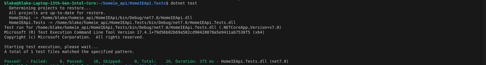

# Intro

Thank you for the opportunity.

- **Port**: 5185
- **Swagger**: [http://localhost:5185/swagger/index.html](http://localhost:5185/swagger/index.html)
- **Walkthrough**: xxx

## Notes

- I used .NET 7, as it offers more available support and features.
- SQLite Database: I built the model for the data structures' first layer. Nested objects and lists were serialized for simplicity in this implementation.

## How to Run

I included a `docker-compose` file to build and run the server. Run the following commands from the root directory:

```bash
docker-compose build
docker-compose up
```

After running, the server will be available at:

- http://localhost:5185

## Below is a Snapshot of the Test Cases

This image demonstrates test case outputs for the implemented API:



---

---

## Brief

#### MyHome.ie Technical Test - Back End Software Developer

Build a RESTful Web API that serves the attached list of properties from a database. This should allow adding, editing, deleting and getting the property as required.
Please also provide:

1. Unit tests as part of this API showing a TDD approach.
2. A swagger or some kind of documentation for the API.

We are looking for code that is simple, well architected, maintainable, testable, and sticks to the brief.

Create a GIT repository for your project and send a link once complete.
